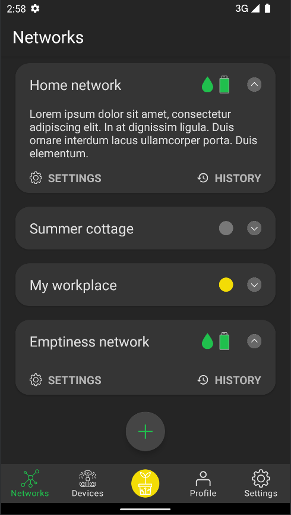
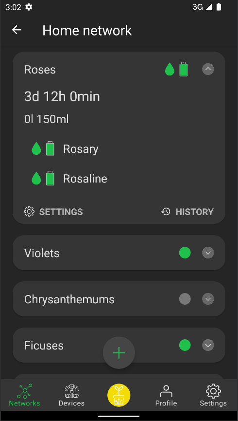
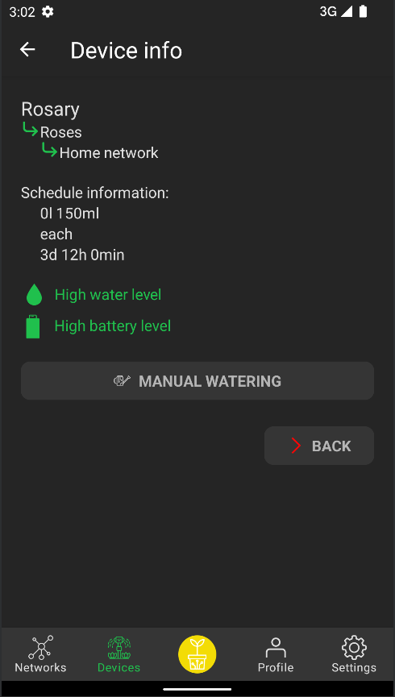
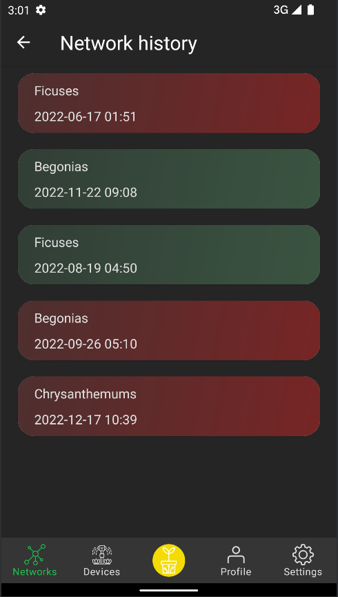
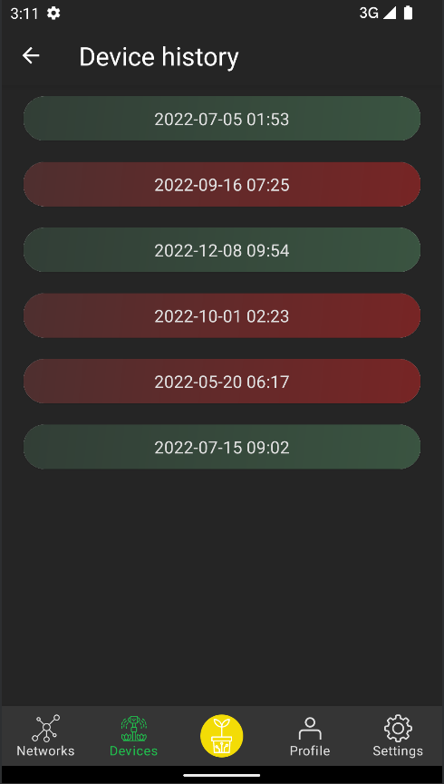
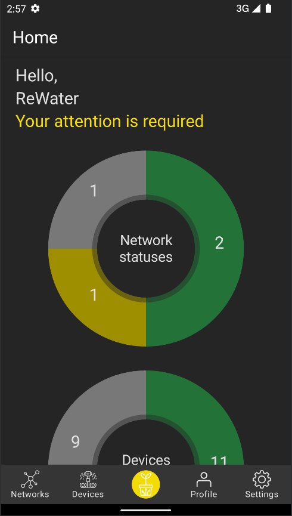

# ReWater

**Re**mote **Water**ing application helps to manage the system of distributed watering stations.

## Application Description

This application allows the user, using his account in the ReWater service, to manage distributed
remote irrigation networks.

The user can manually control each ReWater device, as well as set irrigation schedules for groups of
devices.

The user always receives up-to-date information about the status of devices, schedules, and
networks. Each of the statuses is assigned a certain intuitive color, which speeds up the process of
assessing the state of a particular entity.

The user can also receive information about the fulfillment of the tasks of automated irrigation
according to the schedule or irrigation in manual mode. This feature is available for all networks,
schedules and devices.

The application builds graphs for a more representative representation of status information.

## Requirements

#### For personal use:

- Android 10 or above with Bluetooth and Internet connections.

#### For development:

- Android 10 (API 29) or above with Bluetooth and Internet connections.
- Java 11

## How to use

#### For personal use:

1. Download APK from the releases tab to the smartphone.
2. Install APK.

#### For development:

1. Clone this project with `git clone https://github.com/MrBattary/ReWater.git`
2. Use Android Studio or `./gradlew <task-name>` to build this application.
3. Use an emulator or manually download the apk file to the real or virtual device.

## Developers

Michael Linker - development, design and everything else related to this application.